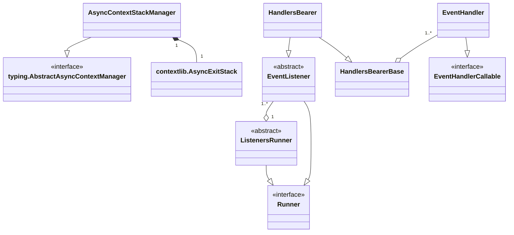

# PyEventFlow
PyEventFlow is a library simplifying development of event-based apps which interacts with internal and remote objects via events.

## Architecture
**Work In Progress**

```mermaid
classDiagram
    class `typing.AbstractAsyncContextManager`
    <<interface>> `typing.AbstractAsyncContextManager`
    
    class `contextlib.AsyncExitStack`
    
    class AsyncContextStackManager
    AsyncContextStackManager --|> `typing.AbstractAsyncContextManager`
%%    `contextlib.AsyncExitStack` "1" --* "1" AsyncContextStackManager
     AsyncContextStackManager "1" *-- "1" `contextlib.AsyncExitStack`

    class HandlersBearer

    class EventListener
    <<abstract>> EventListener
    HandlersBearer --|> EventListener

    class EventHandler
    EventHandler "1..*" --o "*" HandlersBearerBase

    class EventHandlerCallable
    <<interface>> EventHandlerCallable
    EventHandler --|> EventHandlerCallable

    class HandlersBearerBase
    HandlersBearer --|> HandlersBearerBase

    class ListenersRunner
    <<abstract>> ListenersRunner
    ListenersRunner --|> Runner
    EventListener "1..*" --o "1" ListenersRunner

    class Runner
    <<interface>> Runner
%%    <<abstract>> Runner
    EventListener --|> Runner

```
